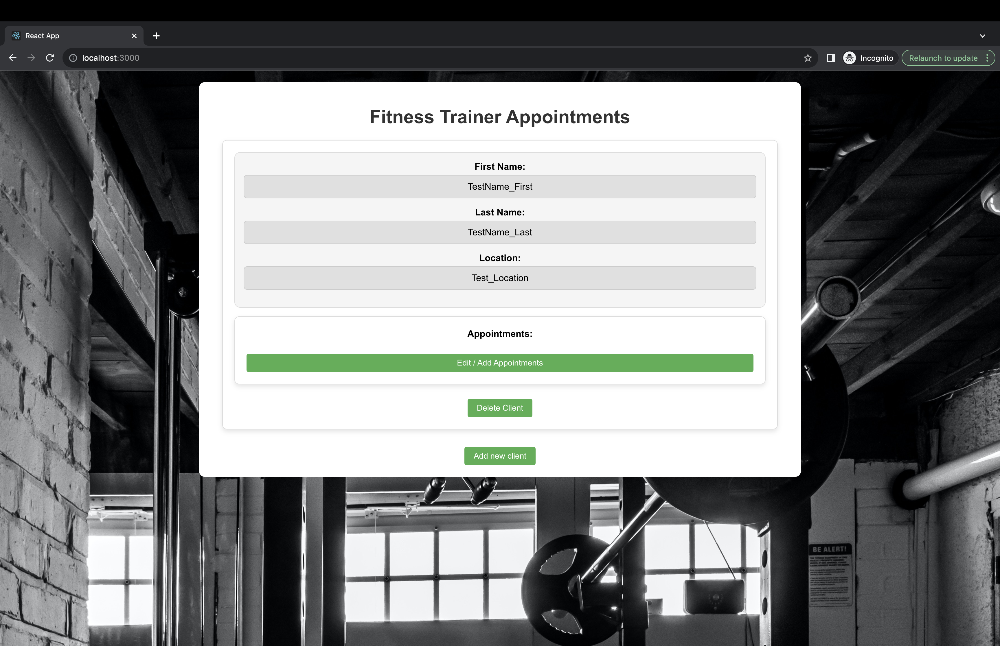
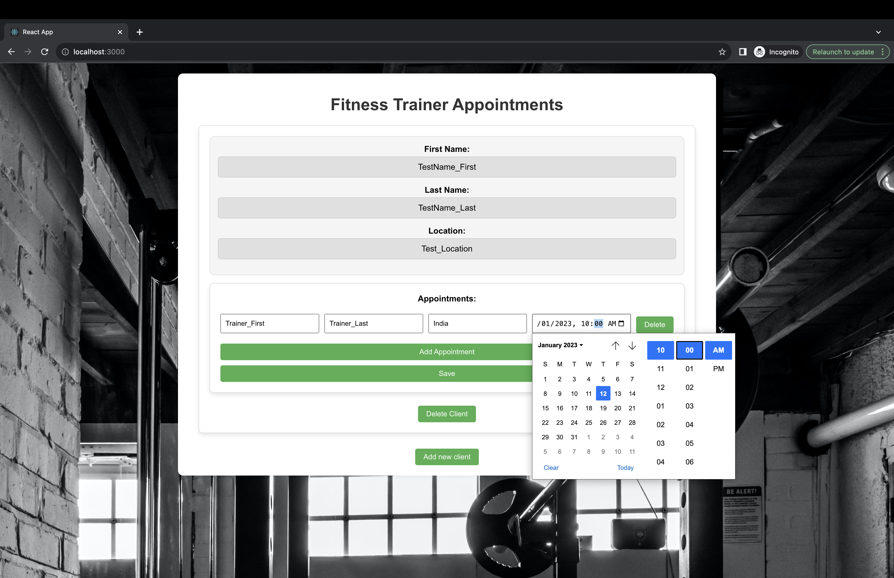
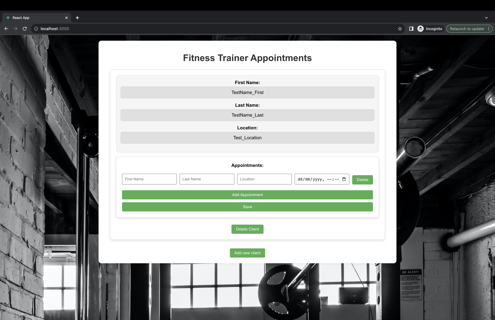
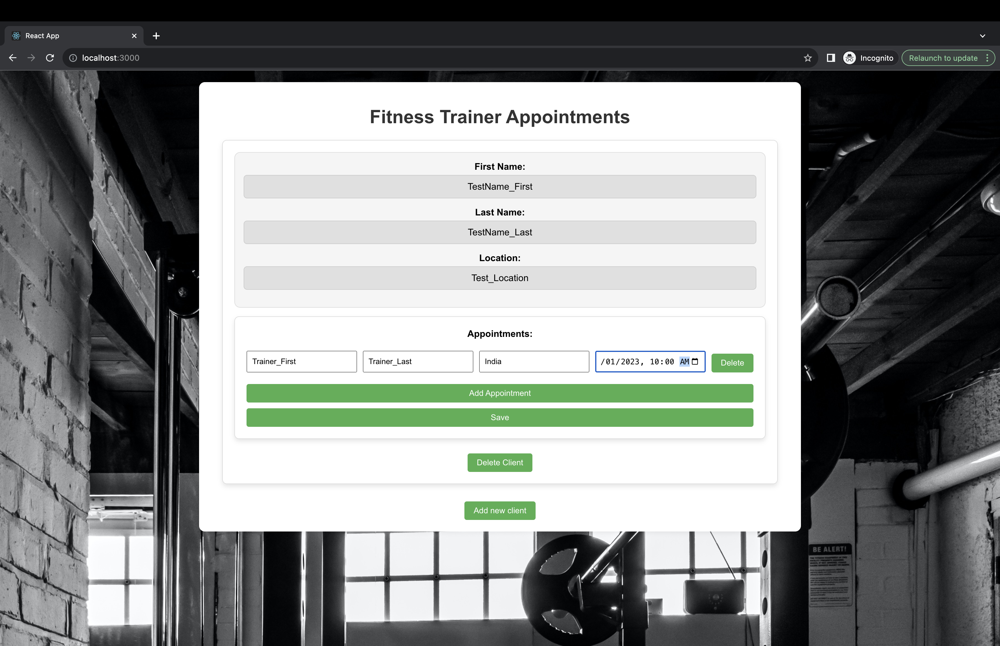
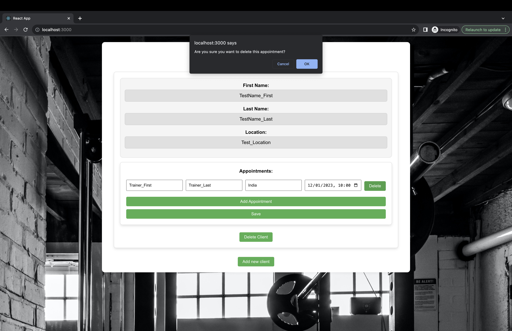
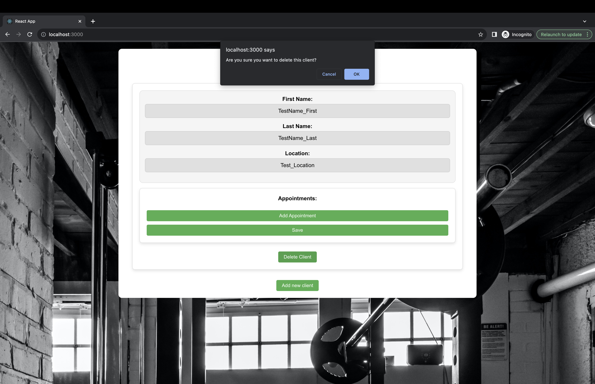

# Fitness Trainer Appointment Scheduling Website

## Overview

This project is a front-end web application designed to assist fitness trainers in managing appointments for their clients efficiently. The application provides a user-friendly interface with features such as adding, editing, and deleting appointments, along with client details. Additionally, a bonus calendar view page is implemented for a convenient overview of all scheduled appointments.

## Table of Contents

1. [Installation](#installation)
2. [Usage](#usage)
3. [Features](#features)
5. [Technology Stack](#technology-stack)
6. [Screenshots](#screenshots)

## Installation

To run this application locally, follow these steps:

1. Clone the repository:

   ```bash
   git clone https://github.com/your-username/fitness-trainer-appointments.git
   ```
2. Navigate to the project directory:
    ```bash
    cd fitness-trainer-appointments
    ```
3. Install dependencies:
    ```bash
    npm install
    ```
4. Start the development server:
    ```bash
    npm start
    ```
5. Open your web browser and go to http://localhost:3000 to use the application.

## Usage

The application provides an intuitive interface for fitness trainers to manage client details and appointments. Below are the key features:

### 1. User Interface (UI)

- Modern and responsive grid layout for clients.
- Editable fields for First Name, Last Name, Location, and Appointments.

### 2. Adding Appointments

- Click the "Add Appointment" button within each client's row.
- Use the date and time picker to select the appointment date and time.

### 3. Editing Appointments

- Edit existing appointments' date and time.
- Inline editing of client information within the grid.

### 4. Deleting 
Appointments

- Click the delete icon to remove individual appointments.
- Confirmation step to prevent accidental deletions.

### 5. Appointments Field

- Displays all scheduled date-times for each client.
- Multiple appointments are organized for easy reference.

### 6. User-Friendly Experience

- Informative error messages and notifications.
- Feedback on successful actions (e.g., appointment added, edited, or deleted).

## Technology Stack

- HTML
- CSS
- Javascript
- React


## Screenshots
- Landing Page

- After clicking on `Add New Client` Button and filling details

- Adding Appointments by clicking `Edit/Add Appointments`, this also has `calendar Feature`





- Can also `Delete Appointment`, after deleting it will give a confirm message.

- Same happens if user clicks on `Delete Client`


- This is Screenshot demo of whole project.

**Thank you for reading this.**


